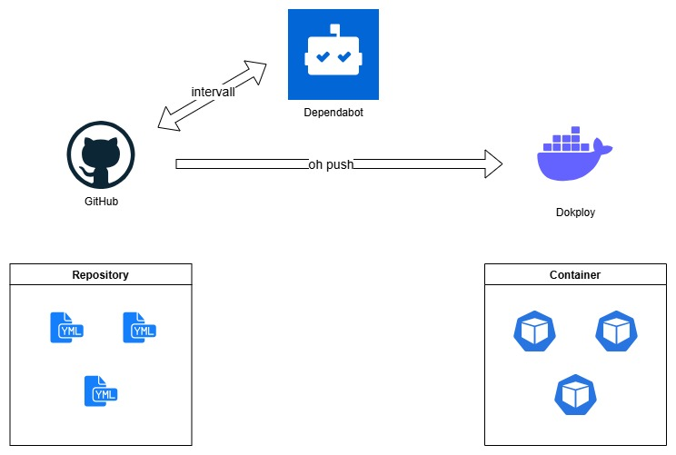

# Prerequisites

- Hetzner Account
- Github Account

## Step 1 - Generate SSH Keys

- Run command "ssh-keygen -t ed25519" in terminal

## Step 2 - Hetzner Project

- Select ``Console` and create a new Project

### SSH-Key

- Select `Security` and add a SSH-Key. Copy the whole content of the id_ed25519.pub file into the input field

### Server

- Select `Server` and add a Server.
- Choose a Server-type and location.
- For a Image klick on `Apps` and select Docker CE.
- Add yor SSH-Key and scroll down `Name`.

### Firewall 

- Klick on the new Server and select Tab `Firewalls`. Then `Create Firewall`.
- The presets can stay. Just add one new incoming-rule with port `3000`. Then click `Create Firewall` again.

## Step 3 - Connect to Server via SSH

- Open the Terminal and type `ssh root@<Server-IP>`

## Step 4 - Install Dokploy

Run `curl -sSL https://dokploy.com/install.sh | sh` in the Terminal


# Hetzner Storage Box (optional)

If you want more and cheap storage you can use [Hetzner Storage Box](https://docs.hetzner.com/de/storage/storage-box/) and connect it via [rclone](https://rclone.org/) for encrypted access.

## Step 1 - Setup Hetzner Storage Box


## Step 2 - Connect to Dokploy-Server via SSH

- Run `ssh root@your-server-ip-address`

## Step 3 - Install Rclone 

- Connect to your VPS Server via SSH
- Run `apt  install rclone`

## Step 4 - Create a SSH Key for Rclone

- Run `ssh-keygen -t ed25519 -f ~/.ssh/storagebox -C "DokployStorageBox"`
- Hit Enter twice to set no passphrase
- Run `ssh-keyscan uXXXXX.your-storagebox.de >> ~/.ssh/known_hosts`

- Execute `cat ~/.ssh/storagebox.pub` then to get the public key.
- Copy that key and add it to your Hetzner project ssh keys

## Step 5 - [Rclone Config](https://docs.hetzner.com/storage/storage-box/access/access-ssh-rsync-borg#rclone)

- Run this command with your password `rclone obscure YOURSUPERSECUREPASSWORD` and copy the result.
- Run `nano ~/.config/rclone/rclone.conf` and paste the following code with your values for host, user and pass.

``` conf
[storagebox]
type = sftp
host = uXXXXX.your-storagebox.de
user = uXXXXX
port = 23
pass = <obscured-password>
```

## Step 6 - Testing

- Run `rclone ls storagebox:` to test the connection
You should get a result like `247 .ssh/authorized_keys`.

## Step 7 - Create Directory

- Run `rclone mkdir storagebox:data` to create a data-folder
- Run `rclone lsd storagebox:` to check

## Step 8 - Encryption

- Generate 2 new passwords and create the hash with `rclone obscure`
- Run `nano ~/.config/rclone/rclone.conf` again and append the following code with your password & password2

``` conf
[storagebox-crypt]
type = crypt
remote = storagebox:data
filename_encryption = standard
directory_name_encryption = true
password = YOUR_ENCRYPTION_PASSWORD
password2 = YOUR_SALT_PASSWORD
```

## Step 9 - Mount Directory

- Run `mkdir -p /mnt/storagebox-crypt` to crate a mount directory
- Run `nano /etc/systemd/system/rclone-storagebox-crypt.service`

```
[Unit]
Description=Mount rclone encrypted Storage Box
After=network-online.target
Wants=network-online.target

[Service]
Type=simple
User=root
ExecStart=/usr/bin/rclone mount storagebox-crypt: /mnt/storagebox-crypt \
  --allow-other \
  --buffer-size 256M \
  --dir-cache-time 12h \
  --vfs-cache-mode writes \
  --vfs-cache-max-size 512M \
  --vfs-read-chunk-size 64M \
  --vfs-read-chunk-size-limit 256M \
  --poll-interval 1m \
  --timeout 1m \
  --log-level INFO \
  --allow-non-empty
Restart=on-failure
RestartSec=10

[Install]
WantedBy=multi-user.target
```

With this the local mount directory will be connected with the storagebox.
Every Folder for the Applications will be created automatically based on your docker-compose configuration.

This would cause an error somehow because the connection will be lost after time. to fix that there is a symbolic-link needed.
Run `ln -s /mnt/storagebox-crypt /media/storagebox-crypt` to create a link that uses the media directory.
Your services should use `/media/storagebox-crypt` instead of `/mnt/storagebox-crypt` in the volume settings.


- Then Run `systemctl start rclone-storagebox-crypt.service`
- And don't forget to enable it to start it automaticaly `systemctl enable rclone-storagebox-crypt.service`


# IMPORTANT DIRECTORIES

## Volumes on local machine
ls /var/lib/docker/volumes

rclone ls storagebox-crypt:


# Wireguard

- sudo apt install wireguard
- sudo nano /etc/wireguard/wg0.conf

Copy the config into the file and modify it

```

[Interface]
PrivateKey = 
Address = 10.8.0.2/24

[Peer]
PublicKey = 
PresharedKey = 
AllowedIPs = 192.168.1.0/24
PersistentKeepalive = 25
Endpoint = 
```


- sudo wg-quick up wg0
- sudo wg
- ping 192.168.1.10


# Backup-Job (with [Wireguard](#wireguard) & Rclone)

- Run `nano ~/.config/rclone/rclone.conf` again and append the following modified configuration.

```
[nas]
type = smb
host = 192.168.x.x
user = your_nas_username
pass = your_nas_password
```

after that run `rclone sync storagebox-crypt: nas:/YourShareName --progress --checksum` to sync the data manually.

To run the sync automatically create a sh-file with `nano /usr/local/bin/backup_storagebox.sh`

```
# Start WireGuard VPN
sudo wg-quick up wg0

sleep 5

rclone sync storagebox-crypt: nas:/YourShareName --progress --checksum

sudo wg-quick down wg0
```

Then make the script executable with `sudo chmod +x /usr/local/bin/backup_storagebox.sh`
Edit cronjob file with `crontab -e`
and add `0 2 * * * /usr/local/bin/backup_storagebox.sh >> /var/log/backup_storagebox.log 2>&1` for example. This runs every day at 2:00 AM then.
